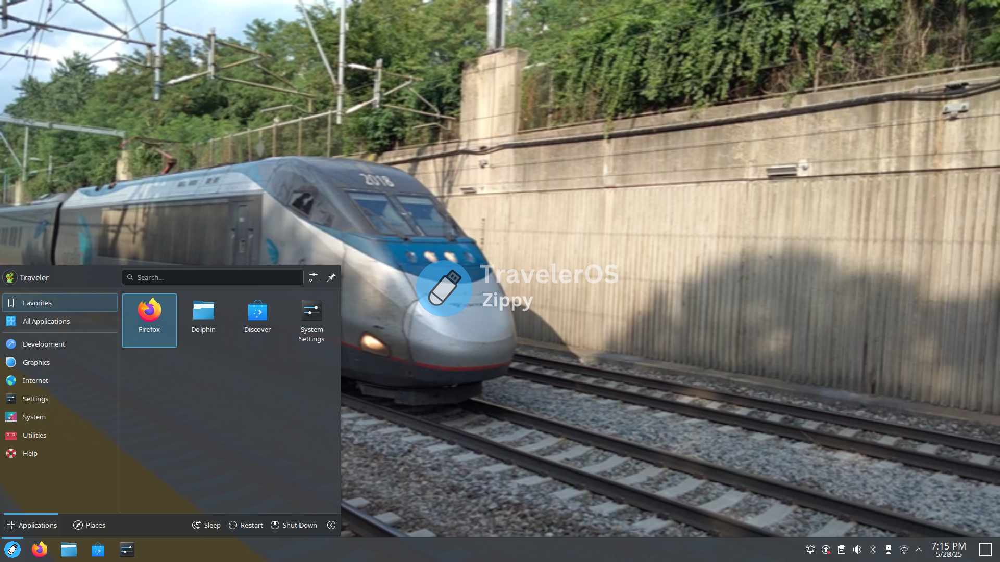

# TravelerOS - A linux distro built for USB drives.

TravelerOS is a lightweight linux distribution aimed for USB drives.

## Lightweight.
TravelerOS uses KDE Plasma, a popular and lightweight desktop enviroment. Perfect for users who mostly use Windows.

## Large collection of apps.
TravelerOS is based on Q4OS, a debian based distro. So you have access to the APT package manager, and TravelerOS comes with flatpak preinstalled! Thanks to Q4OS's built in .deb installer, you can now install .deb packages without having trouble!

## Minimal.
TravelerOS is built to be minimal, so that way you have enough persistent storage on your USB drive
so that way you can store all your apps, games, and other stuff!

## System Requirements
CPU: 1 GHz or faster
RAM: 1 GB 
Storage: Depends on how much storage you have. 32 GB USB's are recommended. 
You also need a 64-bit processor.

## 💿 Installation Guide
For windows computers:
1. Install (or run) Rufus.
2. If you see an option that says **`Persistent partition size`** , then put in a good amount.
   For 32 GB USB's put 20 GB.
3. If you have a USB drive that is less than 32 GB then don't add the persistent partition.
4. Press START.
5. Once done you can either reboot to the USB or eject it.

For linux computers:
1. Extract the ISO image to your USB drive. (Format it first!)
2. Once done, you can either reboot to the USB or eject it.
